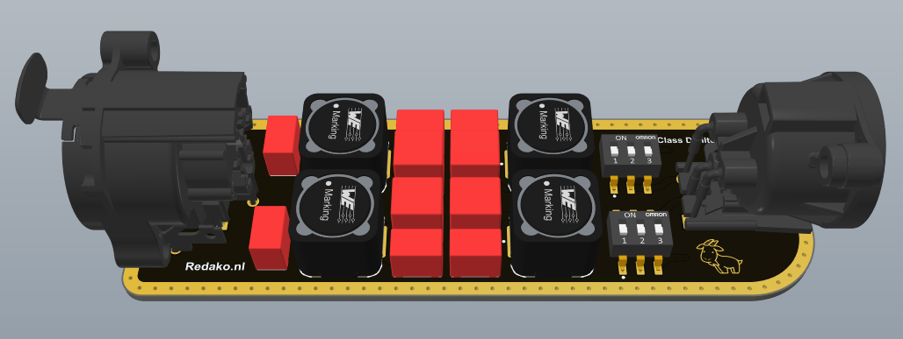
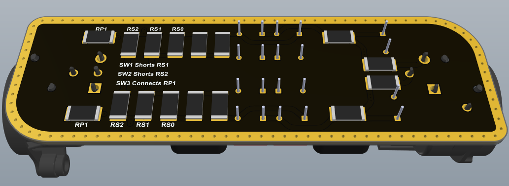
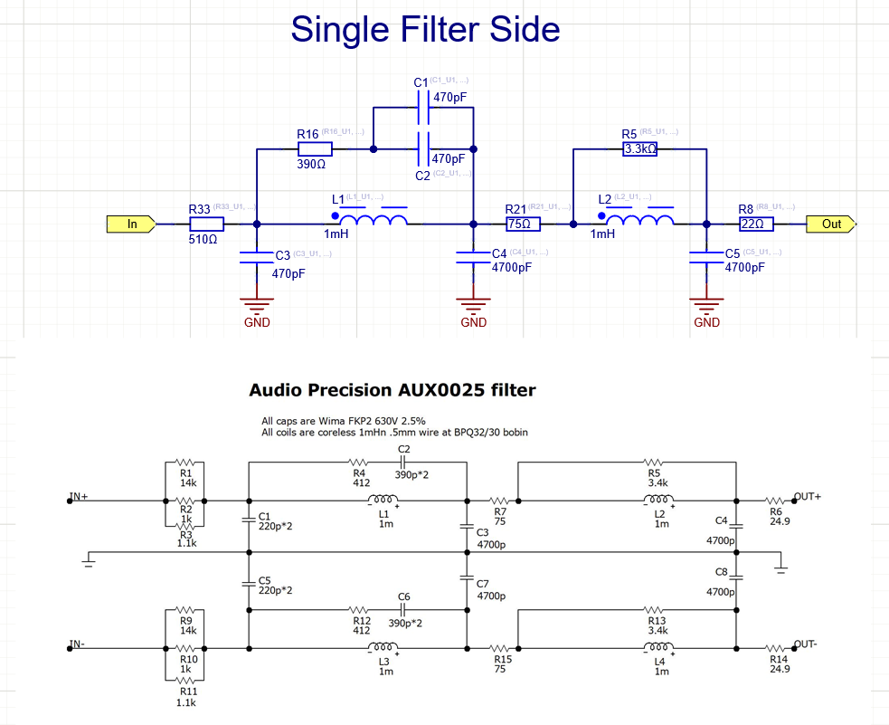
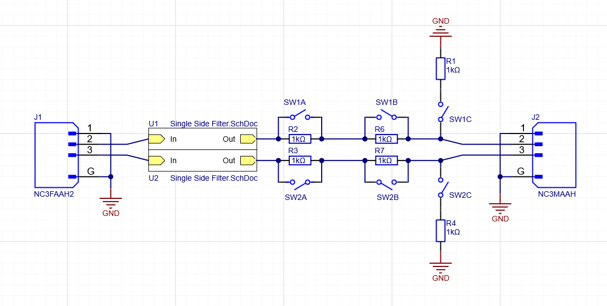
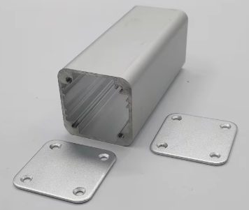

# Redako-AES17-Class-D-Filter

A compact AES17 / Class D Filter board based on the Audio Precision AUX0025, yet with slightly looser tolerances.  

# Schematics

The schematic is based on the AUX0025. The resistors and capacitors values are slightly different (for sourcing reasons), the inductors aren't giant coreless types (for size reasons), and the resistors also have smaller packages. The result is that the frequency response will be slightly different (but according to my simulations still properly flat in the 20Hz-20kHz band), there might be some more harmonic distortion (but I'm not sure until the first boards come in), and the filter's power rating is less than the Audio Precision version - which I'm not expecting to be a problem unless someone assembles it with low series resistors and shorts the output. 

# Series resistors

Besides the AUX0025's 22Ω output series resistor I have added two more, and a parallel resistor to ground, which can all be switched with the output DIP switch. This will allow me to divide the output voltage down to a range my Cosmos ADC will swallow. What these values should be for someone else will depend entirely on the amplifier (voltage) you're planning to measure, the input range of your ADC / scope, and its input impedance. I have added an LTSpice simulation you can play with to determine what's best for you. 

# Enclosure

I'm still looking for a simple extruded enclosure that'll nicely fit the boards. I have a CNC router here I'd be able to make the panel cutouts with. I'm hoping to find something like this in the right size: 

# License

### CC BY-NC

